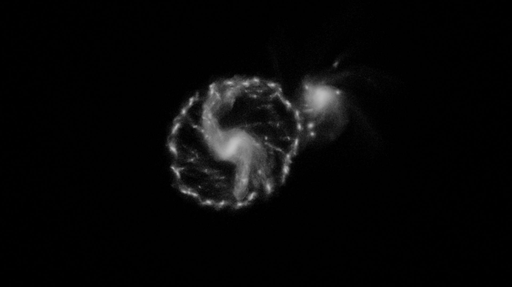

# OpenCL Barnes-Hut simulation
An OpenCL based [Barnes-Hut simulation](https://en.wikipedia.org/wiki/Barnes%E2%80%93Hut_simulation) I coded for fun. While the accelerations are computed on the GPU the octree is (still) built and summarized on the CPU. [This simulation]() of 2.5 million particles ran at around 4 seconds per frame (the precise time varied) on an Nvidia GTX 1660 SUPER GPU.

## Pictures and videos

* [1M particles video](https://www.youtube.com/watch?v=VKtJ99_0jvE)
* [2.5M particles video](https://youtu.be/AeQGQPz8niY)

## Running the simulation
To compile and run the program `OpenCL` and `make` need to be installed. ImageMagick `convert` is also required to convert the images from `.ppm` to `.png` (though the conversion may be disabled by undefining the `PNG` macro). `ffmpeg` may be used to create a video.

The program requires as input the number of particles, the number of frames to generate and the timestep. At the end of the simulation a `final_state.csv` file is generated, which may be used to resume the simulation (the start frame number may also be specified).

### Example
    make prep
    make
    ./main 100000 1000 0.005
    make video
    ./main 100000 500 0.005 final_state.csv 1000
    make video

## Kernels and functions

### C functions

#### `fill_tree`  
Creates an octree inserting each particle in the appropriate node.
#### `summarize_tree`  
Calculates the mass and center of mass of each node in the octree.

### OpenCL kernels

#### `compute_accelerations`  
Computes accelerations using a naive $O(n^2)$ algorithm (it can be used instead of `barnes_hut_accelerations` by undefining the `BH` macro).
#### `verlet_new_pos` and `verlet_new_vel`  
Calculate the particles' new positions and velocities on each timestep using the [velocity Verlet](https://en.wikipedia.org/wiki/Verlet_integration#Velocity_Verlet) algorithm.
#### `barnes_hut_accelerations`  
Computes the accelerations using the Barnes-Hut algorithm.
#### `count_particles`, `process_image` and `f2rgb`  
Generate an image to be output to a `.ppm` file (which by default is then converted to a `.png` using ImageMagick's `convert` tool).

## To do
* Optimize the `barnes_hut_accelerations` kernel (which accounts for around 90% of the execution time)
* Implement the tree building and summarization functions as OpenCL kernels.
* Generate a "physically accurate" initial state.
* Find another way to generate and output images (OpenGL maybe?) which produces better results and doesn't rely on `convert`.